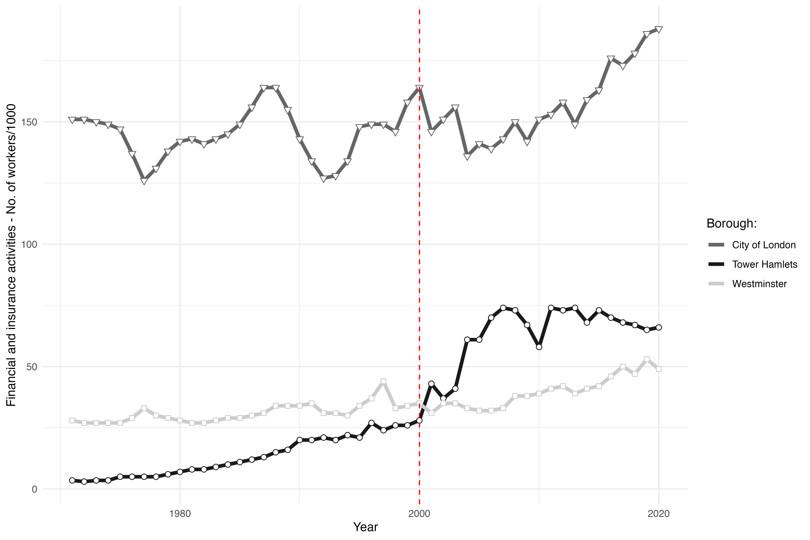

# PRE DOC

This is an overview of data (spatial) visualisation examples in support of my application as a pre-doctoral Research Assistant. The repository is structured in the following way: 

1. coding_sample:
This file consists of all the relevant code necessary to replicate the plots within this repository. In order to reproduce the results the working directory on your machine should be changed to this repository. Please note that some of the raw R plots are post-processed using affinity designer. Therefore the produced output is not necessarily final. 

2. plots:
This folder consists of all the intermediate plots used in producing the final results. That is pre-processed shaded reliefs generated in QGis, but also the plots produced by R which are then post-processed. 

3. RAW:
This folder consists of all the datasets which are used in order to produce the results. In addition, this folder also contains the relevant shapefiles necessary to produce the results. In case you are interested in the source of these datasets, please refer to the following sources for each dataset (date: 15.02.23): 

covid.csv: https://data.dhsgis.wi.gov/datasets/wi-dhs::covid-19-historical-data-by-census-tract-v2/explore

employees.csv: https://data.london.gov.uk/dataset/workplace-employment-industry-borough

floorspace.csv: https://www.gov.uk/government/statistics/non-domestic-rating-stock-of-properties-including-business-floorspace-2021

school.sav: https://nces.ed.gov/surveys/pss/tableswhi.asp

uber.csv: https://movement.uber.com

4. Results:
The results' folder contains the final, post-processed plots which are used in the project. Overall, there are 6 plots for two different projects. 

In the first project, I explore the installment of London City Airport as an accessibility shock to the finance and insurance labor market in central London. I analyze how firm sorting within cities is affected by proximity considerations and international market access. In doing so, I extend upon the known gravitational forces which cause local agglomerations. By identifying key determinants behind the spatial decision of a firm, I add to the literature concerning the geography of firm.

Code: Lines 57-97

Code: Lines 100-187

